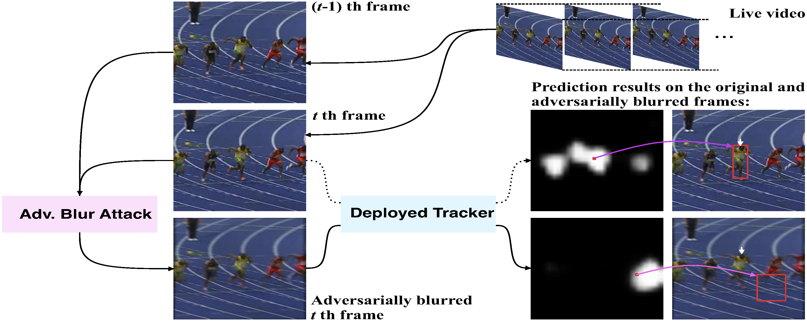
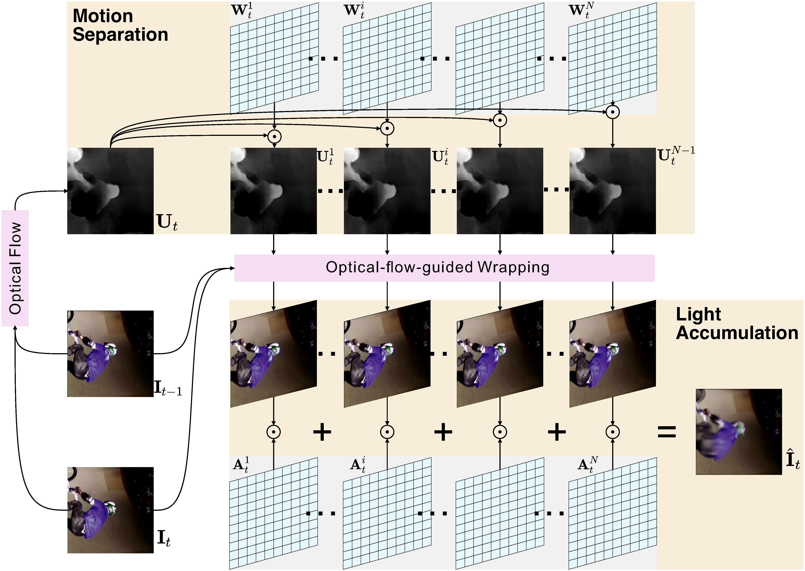
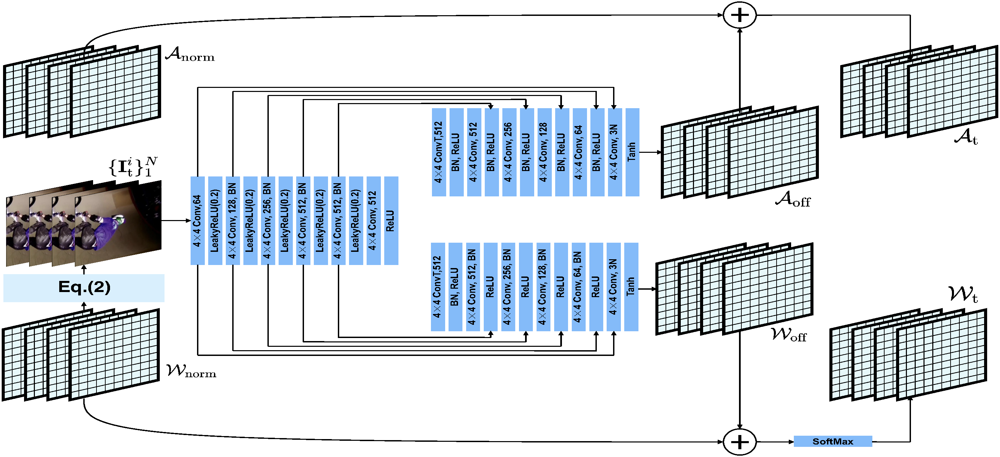
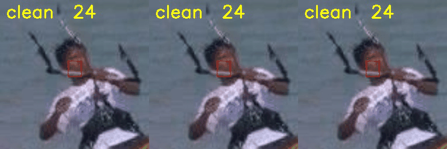
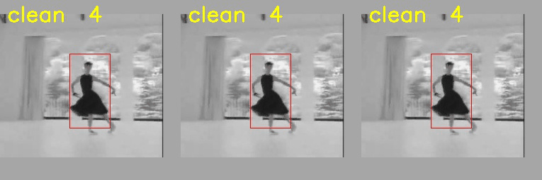
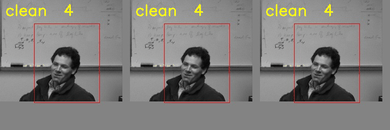

# ABA

We propose the adversarial blur attack (ABA) against visual object tracking.



## Motion Blur Systhensis for Visual Object Tracking



## JAMANet for One-step Adversarial Blur Attack



## Results

<table>
    <tr>
        <td ><center> <p align="center">Case1</p> </center></td>
        <td ><center> <p align="center">Case2</p> </center></td>
    </tr>
    <tr>
        <td ><center> <p align="center">Case3</p> </center></td>
        <td ><center> <p align="center">Case4</p> </center></td>
    </tr>
    <tr>
        <td ><center> <p align="center">Case5</p> </center></td>
        <td ><center> <p align="center">Case6</p> </center></td>
    </tr>
</table>

## Usage

Our implementation is based on [PySOT](https://github.com/STVIR/pysot), You need to follow their installation steps for environment setup.

You can enter the target tracker's directory in the `experiments` folder, run the attack/evaluate experiment with the following command:

```shell
# attack
CUDA_VISIBLE_DEVICES=0 python -u ../../tools/attack_test.py --snapshot  model.pth  --dataset OTB100  --config config.yaml
CUDA_VISIBLE_DEVICES=0 python -u ../../tools/attack_dimp.py --snapshot  model.pth  --dataset OTB100  --config config.yaml
CUDA_VISIBLE_DEVICES=0 python -u ../../tools/attack_kys.py --snapshot  model.pth  --dataset OTB100  --config config.yaml

# evaluate
python ../../tools/eval.py  --tracker_path ./results   --dataset OTB100   --num 10 --tracker_prefix 'cl'
python ../../tools/eval.py  --tracker_path ./results   --dataset VOT2018  --num 10 --tracker_prefix 'clean'
python ../../tools/eval.py  --tracker_path ./results   --dataset UAV      --num 10 --tracker_prefix 'guo'
python ../../tools/eval.py  --tracker_path ./results   --dataset VOT2019  --num 10--tracker_prefix 'csa'
```

## Bibtex

```
@inproceedings{guo2021learning,
      title={Learning to Adversarially Blur Visual Object Tracking},
      author={Qing Guo and Ziyi Cheng and Felix Juefei-Xu and Lei Ma and Xiaofei Xie and Yang Liu and Jianjun Zhao},
      year={2021},
      booktitle={ICCV}
}
```
