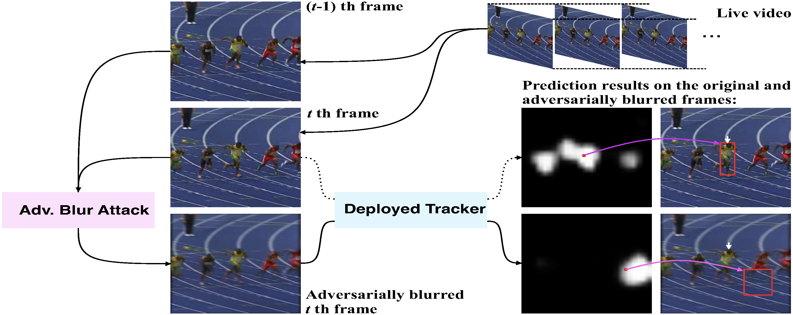
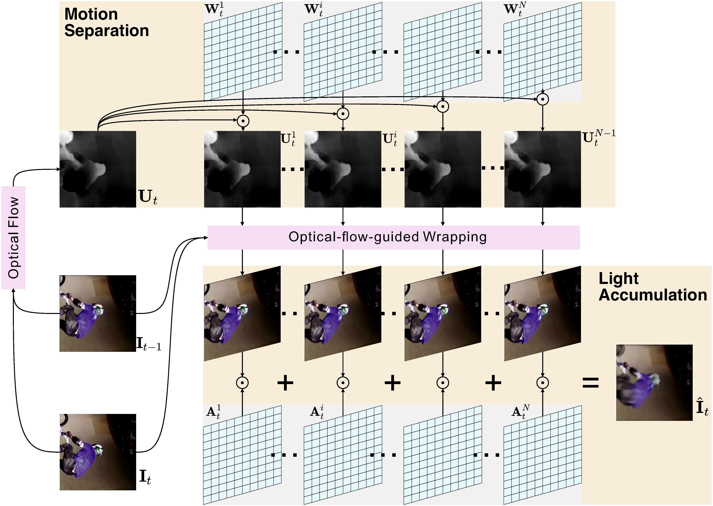
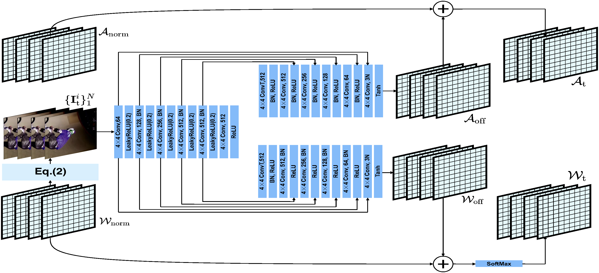
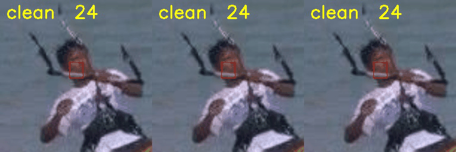
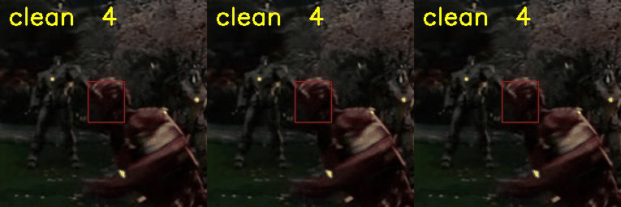
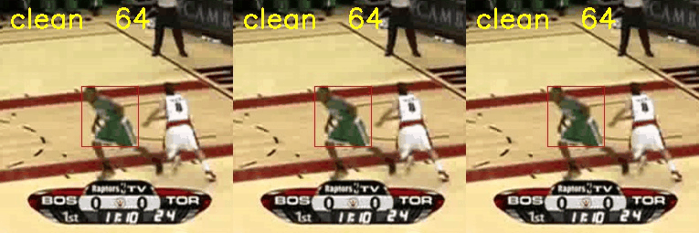
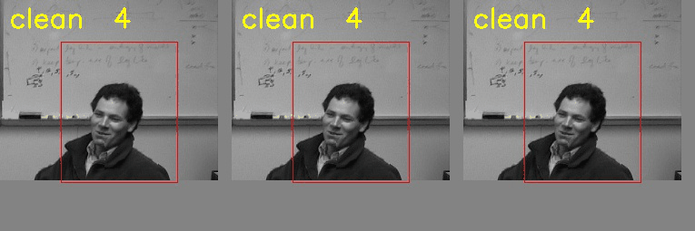
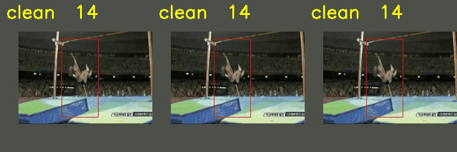

# ABA
We propose the adversarial blur attack (ABA) against visual object tracking. 



# Motion Blur Systhensis for Visual Object Tracking



# JAMANet for One-step Adversarial Blur Attack


## Results

<table>
    <tr>
        <td ><center> <p align="center">GT vs RCDNet</p> </center></td>
        <td ><center> <p align="center">GT vs RCDNet</p> </center></td>
    </tr>
    <tr>
        <td ><center> <p align="center">GT vs RCDNet</p> </center></td>
    </tr>
    <tr>
        <td ><center> <p align="center">GT vs RCDNet</p> </center></td>
    </tr>
    <tr>
        <td ><center> <p align="center">GT vs RCDNet</p> </center></td>
    </tr>
    <tr>
        <td ><center> <p align="center">GT vs RCDNet</p> </center></td>
    </tr>
    <tr>
        <td ><center> <p align="center">GT vs RCDNet</p> </center></td>
    </tr>
</table>


## Bibtex

```
@inproceedings{guo2021learning,
      title={Learning to Adversarially Blur Visual Object Tracking}, 
      author={Qing Guo and Ziyi Cheng and Felix Juefei-Xu and Lei Ma and Xiaofei Xie and Yang Liu and Jianjun Zhao},
      year={2021},
      booktitle={ICCV}
}
```
